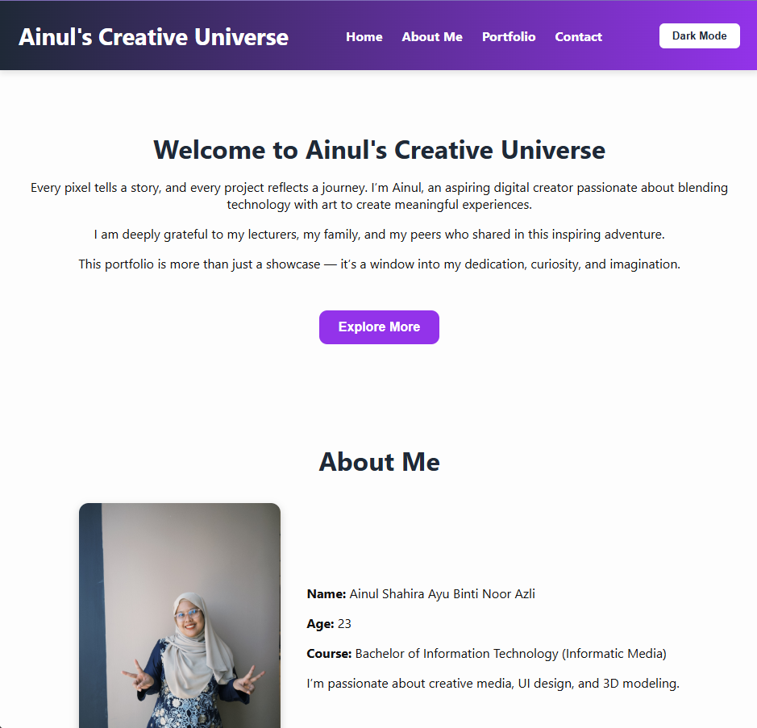
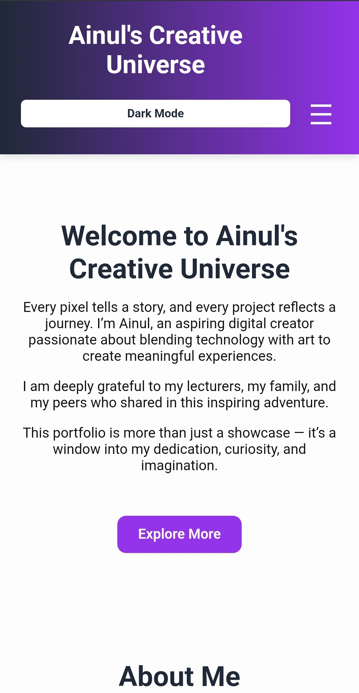

# Ainul's Creative Universe 🌌

Welcome to **Ainul Shahira Ayu Binti Noor Azli's** digital portfolio — a creative space that blends **design**, **UI/UX**, **3D modeling**, and **interactive web development**.

This project showcases my skills in frontend development using HTML, CSS, and JavaScript, with a clean, responsive layout and interactive features.

---

## 🚀 Features

- Responsive design (Desktop & Mobile)
- Dark Mode toggle
- Hamburger menu for mobile navigation
- Smooth scroll to sections
- Organized content: Home, About Me, Portfolio, Contact
  
---

<pre><code>## 📁 Project Structure <code> project-folder/ │ ├── index.html # Main HTML file (homepage) ├── css/ │ └── style.css # All custom styles ├── js/ │ └── script.js # JavaScript functions (dark mode toggle, hamburger menu) ├── img/ │ ├── profile.JPG # About Me image │ ├── modelling.png # Portfolio image - 3D Modelling │ ├── photography.png # Portfolio image - Photography │ ├── UIdesign.png # Portfolio image - UI Design │ ├── artdesign.png # Portfolio image - Art & Design │ ├── desktop.png # Screenshot for desktop view (README) │ └── mobile.png # Screenshot for mobile view (README) └── README.md # Project documentation (this file) </code> </code></pre>

---

## 🚀 How to Use

1. Download or clone the repository.
2. Open the `index.html` file in any modern browser (Chrome, Firefox, Edge, Safari).
3. Browse the website and explore each section: Home, About Me, Portfolio, and Contact.
4. Click the **"Dark Mode"** button to switch between light and dark themes.

---

### 🔍 Device-Specific Instructions

- **Desktop View**  
  Navigation links (Home, About Me, Portfolio, Contact) appear in a horizontal bar at the top header.

- **Mobile View**  
  Tap the **☰ hamburger icon** to open the mobile navigation. Tap a link to navigate and auto-close the menu.

---

## 🛠 Technologies Used

- HTML5
- CSS3
- JavaScript (Vanilla)
- Responsive design with CSS Grid & Flexbox

---

## 🖼️ Preview

### 💻 Desktop View

- The navigation menu appears inline in the header for quick access to all sections. The layout is wide, clean, and designed for larger screens.

### 📱 Mobile View

- The navigation is hidden behind a hamburger menu for a more compact interface. The design is fully responsive and optimized for smaller screens.

---

## 👩‍🎓 Author

**Ainul Shahira Ayu Binti Noor Azli**  
Bachelor of Information Technology (Informatics Media)  
Email: [shahiraayuwork@gmail.com](mailto:shahiraayuwork@gmail.com)  
GitHub: [ainulshahiraayu](https://github.com/ainulshahiraayu)

---

## 📄 License

This project is open for educational and personal use.

---
